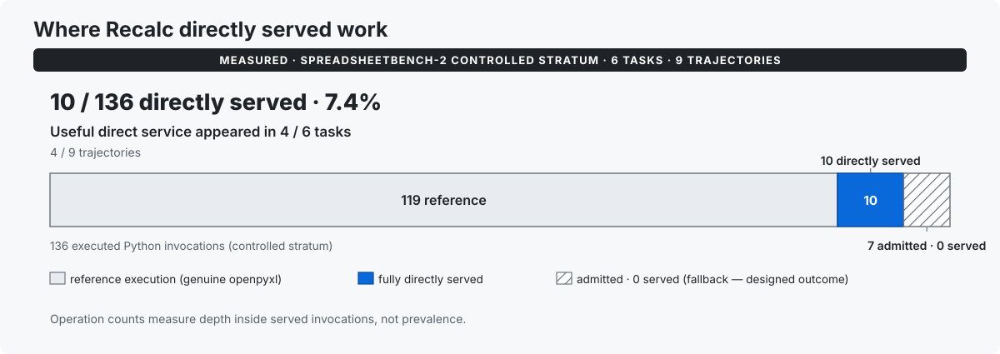

# Recalc performance evidence

This document is the quantitative source of truth for what Recalc has
measured. It is organized around one trajectory: the cost Recalc
targets, what it changes, named task replays with measured benefit, a
named substep example, boundary cases where local acceleration did not
move the task, population evidence with distribution context, workload
fit, methodology, and what is not claimed.

Every number below carries its scope: unit, benchmark/task identity,
trajectory where applicable, comparator, warm/cold regime, released
product vs historical candidate, and reducer. The canonical
machine-readable record is
[research/benefit_evidence_ledger/benefit_ledger.json](research/benefit_evidence_ledger/benefit_ledger.json)
(77 rows; built by
[build_ledger.py](research/benefit_evidence_ledger/build_ledger.py)
from frozen primaries).

## 1. What performance means for Recalc

Recalc is a selective execution/read substrate. It does not accelerate
all spreadsheet work. Its performance target is narrow: repeated
`load_workbook`-driven reading can repeatedly pay workbook
parsing/materialization cost when an agent revisits unchanged workbook
state, and Recalc lets supported reads reuse validated workbook read
state instead of paying that cost again. Everything outside the
certified direct contract — unsupported, uncertain, dynamic, or
mutating behavior — stays on genuine openpyxl.

Whether that mechanism matters to a run depends on how much expensive
certified-read work the run contains. The rest of this document shows
where that has been measured: two task replays where it moved the
total, one inspection step where the mechanism is tangible, and the
cases where local acceleration did not propagate.

## 2. Measured task-replay benefit

The two strongest user-relevant results come from paired task-execution
replay in the frozen Tier 1 external-validity study
([report](research/external_validity_tier1/REPORT.md), frozen verdict
`EXTERNAL_VALIDITY_STRENGTHENED`). Each replayed every Python block of
one model trajectory under plain Python (BASE) and released
`recalc-agent 0.2.0` (RECALC) in the same window with pristine inputs,
then summed per-block paired times. This is task replay, not a
model-in-the-loop end-to-end run: no model calls were re-issued.

### Case A — SpreadsheetBench-2 Debugging:07_01, Claude trajectory

Trajectory `tier1-r01-P-Debugging-07_01`
(`anthropic/claude-sonnet-4.5`). Warm paired task replay, BASE vs
released Recalc 0.2.0.

**15.477 s → 13.210 s**
**2.267 s saved · 14.6% lower**

3 of 13 invocations were directly served (3 served loads, 63 direct
reads, no iteration cells). Their BASE time represented 21.3% of the
replay (descriptive; no threshold implied).

This is a result for this trajectory only, not a Debugging-family
claim: the sibling Mimo trajectory of the same task (r02) regressed
+0.361 s with no direct service, and Debugging:08_06 regressed
despite service (Section 4).

### Case B — SpreadsheetBench-2 Financial_Model:11_05, Mimo trajectory

Trajectory `tier1-r06-O-mimo-Financial_Model-11_05`
(`xiaomi/mimo-v2.6-pro`). Warm paired task replay, BASE vs released
Recalc 0.2.0.

**28.001 s → 26.141 s**
**1.860 s saved · 6.6% lower**

5 of 23 invocations were directly served (5 served loads, 9,271 direct
reads, 5,822 iteration cells). Their BASE time represented 15.8% of
the replay (descriptive; no threshold implied).

This is a result for this trajectory only, not a Financial
Model-family claim: Financial_Model:07_01 regressed +7.2% despite
direct service (Section 4), and the sibling Claude trajectory of this
task (r05) regressed +0.986 s with no service.

### Why these cases matter

In both measured task-replay wins, warm certified read work represented
a meaningful share of total execution cost (served-block BASE shares
21.3% and 15.8%), so savings inside the direct path were large enough
to move the overall replay. The current evidence does not establish
any rule of the form "direct share above X% guarantees benefit" —
Section 4 shows what happens below that uncalibrated region.

The two task-replay wins and the primary boundary case, on one shared axis:

## 3. Released-product substep example

Separate evidence level: one measured read-only inspection step, not
task replay. SpreadsheetBench-2 `Financial_Model_08_02__4ca3ae46295d`
(Project Seafood Model), released-0.2.0 reproduction on the same
script, same workbook, same delivered findings, workbook bytes
verified unchanged:

- BASE: **3.6866 s**; Recalc: **0.7320 s**; **−2.9546 s (−80.14%)**.
- Medians of 3 warm reps per arm, same window; `DIRECT_RUNTIME` 3/3;
  `REUSED` artifacts; 4,800 iteration cells / 120 rows.
- Full provenance (prompt, code, rep timings, parity standard):
  [docs/evidence/readme_vignette/](docs/evidence/readme_vignette/).

The existing
[performance vignette](docs/assets/recalc-performance-vignette.svg)
depicts only this 0.2.0 read-only inspection step. (This workload has
separate R2 and R3 measurement windows on different hosts; see
Section 10. They must not be spliced into one series.)

## 4. Boundary: local acceleration without task benefit

### Primary counterexample — Debugging:08_06, Mimo trajectory

Trajectory `tier1-r14-O-mimo-Debugging-08_06`, same replay protocol
(BASE vs released 0.2.0, warm, paired):

- Task replay: **12.254 → 13.176 s (+0.922 s, +7.5%)** — no task benefit.
- One served block: **0.614 → 0.356 s (−0.258 s)** with 4,607 direct
  reads / 3,480 iteration cells; the mechanism worked locally.
- Served-block BASE share: ~5.0%. The remaining 25 reference blocks
  account for the rest of execution and dominate the total.

Lesson: the served block represented about 5% of BASE replay time.
It became faster locally, but the complete task replay was still
slower because most measured runtime lay outside that served block.
Direct compatibility is not enough; enough costly work must lie
inside the direct path. This is not a mechanism failure; it is
task-level economics.

### Second counterexample — Financial_Model:07_01, Mimo trajectory

Trajectory `tier1-r18-O-mimo-Financial_Model-07_01`:

- Task replay: **39.132 → 41.958 s (+2.826 s, +7.2%)**.
- One served block: **1.891 → 0.346 s (−1.545 s)** with 48 direct reads.
- Served-block BASE share: ~4.8%; the other 41 blocks (XML surgery,
  LibreOffice waits, reference Python) dominate.

Together with Section 2, the four served trajectories order cleanly by
served share (21.3% and 15.8% improved; 5.0% and 4.8% did not), which
motivates the workload-fit section without calibrating any threshold.

## 5. Direct-served blocks in the controlled study

Across the 6 original-SpreadsheetBench-2 tasks (9 trajectories, 136
executed Python invocations), 10 invocations were fully directly
served. All 10 were individually faster paired:

- Paired aggregate: **10.226 → 3.447 s (−6.779 s)**.
- Membership: r01 ×3 (63 reads), r06 ×5 (9,271 reads, 5,822 cells),
  r14 ×1 (4,607 reads, 3,480 cells), r18 ×1 (48 reads); each served
  exactly 1 load with 0 fallback loads.

This shows that in these observed directly served blocks, Recalc
reduced block runtime. It does not imply the containing task or
population becomes faster — two of the four containing trajectories
regressed (Section 4). Per-block rows:
[invocation_ledger.csv](research/spreadsheetbench_applicability_audit/invocation_ledger.csv).

## 6. Historical mechanism-effect population (R3)

The R3 full-cell iteration product confirmation (frozen verdict
`PRODUCTIZE`) measured a 30-workload mechanism population. Its primary
pair compares the **OFF predecessor control** (rc3-equivalent,
iteration mechanism disabled) against the **ON candidate** (rc4
iteration mechanism) — not bare openpyxl against released Recalc:

- Σ OFF medians: **102.2582 s** → Σ ON medians: **21.5080 s**;
  **−80.7502 s (−78.97%, reported as −79.0%)**.
- Reducer: per-workload median of 3 warm reps, summed over all 30.
  (Bare-BASE Σ medians were 107.4838 s, carried for reference only.)

Mandatory distribution context (post-hoc descriptives of the frozen
population, from
[tier2_summary.json](research/tier2_distribution_audit/tier2_summary.json)):

- 23/30 workloads faster (exact ON < OFF); 7 slower, all ≤49.7 ms on
  workloads the mechanism does not touch (inside the preregistered
  ±50 ms noise band).
- Median ON/OFF ratio **0.9125**; IQR **0.5497–0.9997**; median
  absolute saving **0.0358 s**.
- Top 3 workloads contributed **84.2%** of positive savings (top 5:
  93.7%); the aggregate benefit is real but heavy-tailed.

The 30 decompose as 13 iteration-only targets + 8 pre-existing direct
+ 9 blocked on other grounds; all 13 targets converted to
`DIRECT_RUNTIME` and stayed direct (13/13). The aggregate denominator
is all 30 — never imply all 30 went direct. Parity: 40/40 adversarial
+ 52/52 A/B differential vs pinned openpyxl. Do not call −79% a
typical-workload effect: the median workload improved 8.75%.

## 7. Controlled SpreadsheetBench-2 applicability

The Tier 1 controlled stratum (6 original SpreadsheetBench-2 tasks, 9
trajectories) is a boundary/generalization study, not a performance
win. Reconstructed in
[summary.json](research/spreadsheetbench_applicability_audit/summary.json):

- 138 canonical blocks → 137 replayable → **136 executed Python
  invocations**: **119 reference / 10 fully direct / 7
  admitted-but-fell-back**.
- Useful service (≥1 served load) appeared in **10/136 invocations
  (7.4%)**, spread across **4 of 6 tasks** and 4 of 9 trajectories.
  All 7 fallback invocations served **zero** direct loads
  (`missing_stale_corrupt_artifact`): the admission rate (17/136 =
  12.5%) is classifier coverage, not applicability.
- Aggregate paired subset replay: BASE **112.754 s** vs Recalc
  **114.410 s (+1.656 s, +1.5%)** — no aggregate speedup.
- Depth (not prevalence): 10 served loads, 13,989 direct reads, 9,302
  iteration cells — all inside the same 10 invocations. Operation
  counts must never denominate workload statements.

Direct service appeared in multiple tasks, but only a small fraction
of executed Python invocations were directly served. The controlled
stratum and the R3 mechanism population were selected differently:
the former contains six mechanically selected original
SpreadsheetBench-2 tasks with nine model trajectories; the latter
contains 30 frozen SpreadsheetBench-2 read scripts. They must not be
pooled.

## 8. When to expect benefit

Best-supported technical formulation: Recalc is most useful when a
sufficiently large share of total cost comes from warm, certified
workbook-read work that it can serve directly. Reader-facing: Recalc
helps most when expensive workbook reading — on data already
validated once — accounts for a meaningful part of the run.

**The strongest fit observed so far has these characteristics:**

- validated workbook state can be reused (warm);
- workbook-reading work is expensive (large parses, wide scans);
- reads fall inside the certified contract (point reads, certified
  full-cell iteration);
- served-read cost is enough to matter relative to the rest of
  execution (Sections 2 and 4).

**Little or no task-replay benefit has been observed when:**

- execution is a cold first touch (state must be built);
- reads are cheap or small;
- mutation/write-heavy work dominates;
- mutation-containing invocations or other unsupported/dynamic
  semantics dominate (`data_only`, rich objects, escape, etc.);
- most runtime lies in other Python work, LibreOffice/recalculation
  waits, XML manipulation, or large reference-path residuals.

No numeric direct-share threshold is established; the four served
trajectories motivate the direction only.

## 9. Cold, writes, memory, and component evidence

Secondary evidence; none of it is a task claim.

**Cold.** No cold speedup is supported. R3 target-subset cold check
(fresh cache, ON vs OFF): median delta −0.049 s — no material
difference; the FM:08_02 pair was +1.29/+1.32 s cold, reproducing the
known artifact-build economics (build/ref ≈ 1.37), not a regression.
First-touch runs build state; value accrues on warm reuse.

**Writes.** Writes are not accelerated by the current direct-read
contract. No write block was served in any study; ordinary openpyxl
compatibility must not be read as mutation support.

**Memory (measured case).** Large-workbook peak RSS on
Debugging_10_10: **997,968 KB → 148,296 KB (85.1% lower)**,
confirming reduced materialization on that workload — not universal
memory reduction.

**Decode component (D1).** Artifact decode mass 5.014 → 1.896 s with
warm total 13.158 → 10.157 s on the D1 population. Component-level
only, in the released-mechanism lineage (rc5); not a task result.

## 10. Methodology and comparator definitions

**BASE.** Bare Python/openpyxl execution of the same script. Exact
form differs by study (R3: bare interpreter, median-of-3; Tier 1:
same-window paired replay, single run per block; vignette:
median-of-3 fresh-dir runs) — never assume one BASE across studies.

**OFF.** R3 only: rc3-equivalent predecessor with the iteration
mechanism disabled. The 102.26 s side of the R3 aggregate.

**ON.** R3 only: iteration-enabled rc4 product candidate. The 21.51 s
side. A historical candidate, not released 0.2.0.

**Released Recalc 0.2.0.** Used in Tier 1 replay and the FM:08_02
vignette reproduction. Only these rows may be described as released
product behavior.

**Regimes and reducers.** Warm = validated state present (`REUSED`
artifacts); cold = fresh cache (`BUILT`). R3/R2/vignette use
median-of-3 warm reps; Tier 1 uses single paired replay per block
with the triage rule in `REPLAY_TRIAGE.json` (165/166 rows usable;
r18 step 29 excluded as unreplayable, r18 step 47 block 1 empty).
Studies ran on different hosts and windows — never combine them into
one synthetic time series. Distribution statistics beyond each
study's preregistered primary are labeled post-hoc descriptives of
that frozen population, never superpopulation estimates.

**Per-case forensic detail (Sections 2 and 4).** Replay-validity
mixes; every non-`VALID` row was triaged as environment-only in
[REPLAY_TRIAGE.json](research/external_validity_tier1/REPLAY_TRIAGE.json):
r01: 11 `VALID` + 1 `VALID-both-failed` + 1 `MISMATCH`; r06: 20
`VALID` + 3 `MISMATCH`; r14: 21 `VALID` + 1 `VALID-both-failed` + 4
`MISMATCH`; r18: 33 `VALID` + 3 `VALID-both-failed` + 6 `MISMATCH` + 1
`VALID-unchecked-truncated`. Per-task workbook metadata (byte sizes,
sheet counts) is recorded in
[WORKBOOK_MANIFEST.json](research/external_validity_tier1/WORKBOOK_MANIFEST.json)
(r01: 415,162 bytes, 9 sheets; r06: 593,396 bytes, 18 sheets).

**FM:08_02 measurement windows.** The Section 3 step is one of three
distinct windows for this workload on different hosts, which must not
be spliced into one series: R2 probe 3.0459 → 1.0388 s (BASE vs
research probe); R3 confirmation OFF 5.4570 → ON 1.6696 s (−69.40%,
predecessor-control vs rc4 candidate); released-0.2.0 reproduction
3.6866 → 0.7320 s (BASE vs released product).

## 11. What is not claimed

Recalc does not currently claim: universal spreadsheet-agent
speedup; average real-world speedup; Financial Model or Debugging
family-wide acceleration; cold acceleration; write acceleration;
token or model-cost savings; benchmark-score improvement;
task-quality improvement; speedup whenever a script is admitted;
speedup merely because a workbook is large; or any calibrated
direct-share threshold. Admission means a script qualified for the
direct path — Section 7 shows admitted invocations that served
nothing.

## 12. Reproduction and evidence index

| claim | measurement scope | primary evidence | reconstruction |
|---|---|---|---|
| r01 −14.6% task replay | trajectory, BASE vs 0.2.0, warm | [RUNTIME_REPLAY.jsonl](research/external_validity_tier1/RUNTIME_REPLAY.jsonl) (`tier1-r01-*`), [REPLAY_TRIAGE.json](research/external_validity_tier1/REPLAY_TRIAGE.json) | [benefit build_ledger.py](research/benefit_evidence_ledger/build_ledger.py) |
| r06 −6.6% task replay | trajectory, BASE vs 0.2.0, warm | RUNTIME_REPLAY.jsonl (`tier1-r06-*`) | benefit build_ledger.py |
| r14/r18 counterexamples | trajectory, BASE vs 0.2.0, warm | RUNTIME_REPLAY.jsonl (`tier1-r14-*`, `tier1-r18-*`) | benefit build_ledger.py |
| 10 blocks −6.779 s | served replay blocks, paired | RUNTIME_REPLAY.jsonl (route `DIRECT_RUNTIME`) | [sb2 rebuild.py](research/spreadsheetbench_applicability_audit/rebuild.py) |
| FM:08_02 −80.14% step | read-only inspection step, BASE vs 0.2.0, warm | [timing.json](docs/evidence/readme_vignette/timing.json) | [generate.py --verify](docs/evidence/readme_vignette/generate.py) |
| R3 102.26 → 21.51 s | 30-workload aggregate, OFF→ON, warm medians | [REPRESENTATIVE_RESULTS.jsonl](research/full_cell_iteration_product_confirmation/REPRESENTATIVE_RESULTS.jsonl), [PRODUCT_GATE.json](research/full_cell_iteration_product_confirmation/PRODUCT_GATE.json) | [tier2 build_ledger.py](research/tier2_distribution_audit/build_ledger.py) |
| 10/136 served; 112.754 → 114.410 s | controlled stratum, BASE vs 0.2.0 replay | RUNTIME_REPLAY.jsonl + [TASK_MANIFEST.json](research/external_validity_tier1/TASK_MANIFEST.json) | sb2 rebuild.py |
| cold −0.049 s median | R3 target subset, fresh cache | R3 [REPORT.md](research/full_cell_iteration_product_confirmation/REPORT.md) §11, `_staging/cold_r3.jsonl` | — (archived telemetry) |
| RSS −85.1% case | Debugging_10_10 peak RSS | R3 REPORT.md §12, `_staging/memory_r3.json` | — (archived telemetry) |

Study reports: [R3 REPORT.md](research/full_cell_iteration_product_confirmation/REPORT.md)
(verdict `PRODUCTIZE`), [Tier 1 REPORT.md](research/external_validity_tier1/REPORT.md)
(verdict `EXTERNAL_VALIDITY_STRENGTHENED`), [R2 REPORT.md](research/full_cell_iteration_probe/REPORT.md)
(verdict `MECHANISM_REAL_BUT_NOT_PRODUCT`). Benefit-ledger catalogs:
[positive_cases.md](research/benefit_evidence_ledger/positive_cases.md),
[boundary_cases.md](research/benefit_evidence_ledger/boundary_cases.md),
[claim_support_matrix.md](research/benefit_evidence_ledger/claim_support_matrix.md).
