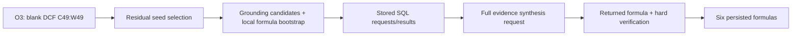

# Resource demand autopsy: Financial_Model:06_01

Verdict: `MULTIPLE_RESOURCE_LOSSES`

## Findings

The 78,777-cell authority did **not** produce 78,777 retrieval sessions. The whole-sheet operation supplied 78,674 authorised cells, but none became a retrieval target before the run stopped. The actual paid trajectory was five assumption-cell decisions followed by sixteen DCF-cell decisions. Large grounding packets were materialized independently for those decisions, repeatedly sending thousands of candidate cells to the model.

There are three measured resource losses: repeated evidence serialization, provider timeouts, and retrieval reconstruction after interruption. There is also a scheduling pressure: replenishing residuals from an earlier operation keeps that operation ahead of other queued operations. The archive does not establish a safe rule for eliminating all residual work while retaining all six edits.

The six saved edits can be replayed from 45 associated calls, versus 142 calls after the frontend. That is a **retrospective accepted-path slice**, selected using the returned outcomes. It is not a demonstrated 97-call saving for an online solver. A first-unit-plus-dependencies rule loses five of the six edits.

The integrated run, outputs, and earlier reports remain frozen. This report supersedes causal claims in the earlier cost report where the archived evidence contradicts them. No model calls or workbook writes were made. Source hashes and replay assertions are in `resource_demand_autopsy/frozen_sources.json` and `summary.json`.

## 1. Exact origin and lowering of authority

The stored O4 says “apply 10% annual interest”, with locus “Balance Sheet Schedules” and no subject. Its returned operation is:

```json
{
  "operation_id": "O4::op1",
  "operation_kind": "FILL_FORMULA",
  "target_set": {"kind": "SHEET", "sheet_id": "sheet:s13"},
  "occupancy_filter": "NONFORMULA_ONLY"
}
```

The compiled sheet is `Balancesheet Schedules`, with used bounds rows 1–1000, columns 1–80. Its rectangle contains 80,000 cells. Removing 1,326 formula cells leaves 78,674: 78,075 blanks, 558 numeric cells, and 41 text cells. Of these, 7,200 are implicit blanks represented by bounds rather than explicit database rows. This faithfully reproduces the stored Edit Plan algebra; expansion itself is not an implementation error.

| Operation | Target expression | After occupancy | First-owner cells | Started sessions | Accepted edits |
|---|---|---:|---:|---:|---:|
| O2::op1 | Five explicit assumption cells | 5 | 5 | 5 | 0 |
| O3::op1 | Blank DCF!C49:W49 | 21 | 21 | 16 | 6 |
| O4::op1 | Nonformula cells of sheet s13 | 78,674 | 78,674 | 0 | 0 |
| O5::op1 | Blank Balance Sheet!J31:Z31 | 17 | 17 | 0 | 0 |
| O6::op1 | Subset of O5's cells | 16 | 0 | 0 | 0 |
| O7::op1 | Employees Expenses!K16 | 1 | 1 | 0 | 0 |
| O7::op2 | Employees Expenses!L16:BR16 | 59 | 59 | 0 | 0 |

The operations contain 78,793 cell memberships. Deduplicating their 16-cell overlap gives 78,777 distinct authorised cells. Runtime `authorised_cells()` assigns an overlapping cell to its first operation with `setdefault`; O6 therefore contributes no owned execution cells. This is the observed ownership policy, not a new recommendation about obligation inheritance.

| Lowering stage | Entering | Leaving | Representation and split/merge |
|---|---:|---:|---|
| Stored plan → expansion | 7 operations | 78,793 memberships | Intensional set expressions become cells |
| Memberships → authority | 78,793 | 78,777 | Overlap deduplicated; first owner retained |
| Authority → possible decisions | 78,777 | 77,011 | 1,816 witnessed peers become 50 canonical units; 76,961 residual cells remain |
| Possible decisions → initial queue | 77,011 | 6 | One candidate per owned operation |
| Replenishment → observed decisions | 6 initial | 21 sessions | Five O2 seeds, then sixteen O3 seeds |
| Sessions → retrieval | 21 | 121 calls | 116 calls in retained sessions plus five abandoned on resume |
| Sessions → synthesis | 21 | 21 calls | One synthesis attempt per seed |
| Synthesis → accepted edits | 21 | 6 | Twelve provider timeouts, three abstentions, six proposals accepted |
| Accepted edits → writer | 6 | 6 writes | No translations or dependency additions |

The 77,011 figure is potential scheduler units under the current policy, not proven irreducible semantic demand. Only 21 were observed. The six accepted formulas have two literal formula strings; the archive does not establish that those two strings constitute a safe two-program representation of the requested task.

### Earliest expensive boundaries

1. **Execution demand:** `compiled_scheduler.activate_available()` selects residual cells without a proposal-derived dependency requirement. After each terminal outcome it replenishes and sorts by operation order. O2 is exhausted first; O3 then repeatedly precedes O4/O5/O7. Five DCF residuals and all later operations remain unserved at the cap. The queue is not empty or dead.
2. **Prompt volume:** `end_to_end_composition_probe.compile_bootstrap()` unions `projection.packet_ids(packet)` into each seed's working set. This recursively includes the full grounding candidate population, independently of the smaller selected authority for that seed. O2 contributes 5,251 candidate IDs; O3 contributes 7,280. Their `base_target_cell_ids` copies are deduplicated by the set, but the candidate population itself remains.
3. **Repeated materialization:** `retrieval_synthesis()` initializes a new working set for every target and ends by serializing the full retained evidence. It stores handles by target but does not read another target's completed working set to continue the next session. Persistence across interruption and reuse across related targets are different properties.

Only 33 authorised cell IDs occur in any retained or abandoned retrieval/synthesis request. O4 contributes seven of them as evidence, four within accepted paths; **zero** O4 cells were retrieval targets. Thus the earlier attribution of most spend directly to the 78k sheet population is unsupported. The larger observed context source is the *grounding candidate population* for O2/O3.

## 2. Mechanical partition of all 78,777 cells

| Exclusive category | Cells |
|---|---:|
| Activated and accepted | 6 |
| Activated without an edit | 15 |
| Never activated, ungrouped residual | 76,940 |
| Never activated, ProgramGroup canonical | 50 |
| Never activated, noncanonical ProgramGroup member | 1,766 |
| **Total** | **78,777** |

All 21 activated cells are ungrouped residuals. None is a ProgramGroup canonical or member. All six accepted dependency units are singletons. There are 50 eligible groups covering 1,816 cells, but no group canonical was called and no formula was translated on this trajectory. The 78,756 unresolved cells are the complete authority minus 21 terminally disposed seeds; “unresolved” therefore includes many cells that never entered execution.

The CSV additionally records overlapping facets: operation membership, first owner, evidence exposure, accepted-path exposure, canonical identity, and explicit formula references. Thirty authorised cells occur in accepted-path requests. The other 78,747 have no direct cell-ID exposure or accepted formula reference in those paths. That establishes absence from the observed direct path, not semantic irrelevance to completing the task. Sheet/row context and hidden model reasoning preclude a stronger universal necessity claim.

“Activated only because of broad authority” is supportable in the narrow mechanical sense that all 21 came from residual eligibility rather than dependency/canonical demand. It does not prove each selection was unnecessary: all six accepted cells were selected that way too.

## 3. Backward slice for the six accepted edits

Every accepted edit belongs to O3::op1, was independently activated, received its own bootstrap and SQL sequence, produced the formula below, passed the existing hard verifier, and persisted through the writer.

| Target | Stored calls | Retrieval | Formula | Path cost |
|---|---|---:|---|---:|
| DCF!C49 | 37–45 | 8 | `=C47*(1-C50)` | $0.120434 |
| DCF!E49 | 49–57 | 8 | `=C47*(1-C48)` | $0.152301 |
| DCF!H49 | 71–79 | 8 | `=C47*(1-C48)` | $0.141014 |
| DCF!I49 | 80–87 | 7 | `=C47*(1-C48)` | $0.124491 |
| DCF!M49 | 107–109 | 2 | `=C47*(1-C48)` | $0.113902 |
| DCF!R49 | 144–150 | 6 | `=C47*(1-C50)` | $0.118937 |
| **Union** | **45 calls** | **39** | **6 synthesis responses** | **$0.771079** |



The direct formula inputs are `DCF!C47`, `C48`, and `C50`. None is in edit authority. `C50` already refers to `C48` in the input workbook. The accepted formulas do not depend on one another or on the preceding failed/abstained targets. Proposal responses contain no evidence citations beyond their formulas and target IDs, so it is impossible to identify which of the other evidence records the model consulted.

`accepted_edit_slices.json` records each exact operation, request hash, call sequence, full evidence-ID set, authority exposure, formula references, and hard-verifier evidence. `evidence_manifests.json` links every session to exact records in the content-addressed evidence pool. These are the records that *were present* for the saved result. Minimal records *necessary for model inference* are unmeasured.

The original scheduler was rerun against stored sessions with inference prohibited and writes intercepted. It reproduced the six edits, all scheduler dispositions, and the unresolved set with unchanged authority. The six accepted proposals also passed the existing hard verifier when replayed individually. This establishes replay reachability, not semantic correctness of each edit.

The six paths contain 8,761 distinct working-set IDs and 11,252,805 user-request bytes, including two retrieval timeouts. These are the observed inputs for the accepted responses, not a demonstrated minimal evidence set.

## 4. Working-set and serialization audit

| Measurement | Observed |
|---|---:|
| Sessions | 21 |
| Bootstrap IDs per session | 6,021–7,664 |
| Final working-set IDs per session | 6,121–8,297 |
| New SQL IDs per session | 0–734 |
| Total working-set ID occurrences | 156,854 |
| Distinct IDs across sessions | 10,473 |
| SQL calls with retained results | 101 |
| Those calls adding no new IDs | 49 |
| Initial bootstrap bytes, summed | 10,845,475 |
| Full synthesis evidence bytes, summed | 21,602,258 |
| User-request bytes, retained sessions | 36,994,983 |

49 zero-ID-growth queries are **not** automatically waste. A SQL result may return scalar values, labels, formulas, or an absence result without a new entity ID. The request and result history is retained for attribution; no rule removing such calls was adopted.

For exact row deduplication, each record identity includes namespace, table, columns and row values. Across sessions, 38,717,242 bytes of this canonical record encoding contain 36,040,455 repeated bytes, about 93.1%. Unique records occupy 2,676,787 bytes. These figures include schema in each record key encoding; `summary.json.serialization` separately reports row-only bytes to avoid confusing this encoding with the actual wire payload. Every session's records reconstruct exactly from the pool plus its ordered manifest.

Excluding the repeated schema encoding, row payloads total 18,399,811 bytes: 1,206,781 unique and 17,193,030 repeated (93.4%). `calls.csv` also records working-set size before/after each retained call, newly added IDs, and SQL-result bytes. State for discarded calls is left unmeasured rather than reconstructed speculatively.

Accepted synthesis requests alone report 511,881–547,679 prompt tokens each. Their large cell tables are the dominant evidence component; for E49, the cell table occupies about 912 KB of 1,105,030 compact evidence bytes. The complete working-set ID list is also serialized both at the transition level and inside its evidence object.

Stable handles already exist in subsequent retrieval turns: the runtime sends a handle, counts, new IDs, query history, and latest SQL result. The initial bootstrap and final synthesis still carry large complete payloads. A persistent record pool can avoid repeated storage/transport materialization with exact reconstruction. A handle by itself does **not** give a stateless model access to omitted facts. Model-token savings and unchanged model decisions under a compact prompt are unmeasured.

### Diagnostic defect

All 21 archived bootstraps report `bootstrap_tokens = 1` and `bootstrap_too_large = false`. `compile_bootstrap()` passes a dictionary to `token_estimate(text)`, whose implementation is `max(1, len(text)//4)`. It counts top-level keys. Serializing those dictionaries first gives roughly 105,742–137,221 character/4 estimates.

This mechanically reproduced diagnostic is wrong, but the integrated retrieval path does not enforce `bootstrap_too_large`; it cannot be credited with a hypothetical cost saving. The frozen runtime was left untouched.

## 5. Counterfactuals and what they establish

| Replay | Authority | Saved edits retained | Measured change | Limit |
|---|---:|---:|---|---|
| Actual scheduler + stored responses | 78,777 | 6/6 | Exact reconstruction | Baseline, no savings |
| Six accepted paths, selected after outcomes | 78,777 | 6/6 | 45 calls after frontend, 53 including the original eight frontend calls | Hindsight selector; not an online policy |
| Omit the five discarded resume calls | 78,777 | 6/6 in frozen trajectory | Five retrieval calls, $0.006339 absent from final paths | Does not predict extra work from a newly available budget |
| First observed unit per operation + accepted dependencies | 78,777 | 1/6 | C49 survives; E49/H49/I49/M49/R49 disappear | Fails the six-edit preservation condition |
| Exact record pool and manifests | 78,777 | Saved evidence reconstructs exactly | About 93.1% repeated canonical record bytes | Storage/serialization result; model-token savings unmeasured |

The accepted-path slice omits 82 retrieval and 15 synthesis calls, 97 total. It retains $0.771079 of the $1.511333 spent after the frontend. Those six paths include all their retained retrieval history, including any provider failure in the path. No response was fabricated and no evaluator gold selected targets.

The requested lazy-materialization policy is already partly present: the scheduler keeps the large tail latent. Tightening it to require initial/canonical/dependency demand cannot recover five accepted residual targets from this archive. Calling every `FILL_FORMULA` member demanded would recover the original residual policy, yielding no demonstrated savings. A new trigger for choosing the useful residuals has not been earned here.

The five discarded calls are 111–115, all for DCF!N49. The final session retains call 110 followed by 116–122. Immutable call logging prevented overwriting those earlier records, but did not make the intermediate SQL working state part of the completed session. This is interruption/reconstruction overhead. It is a small measured loss, not the main explanation for 150 calls.

## 6. Resource attribution

Exclusive accounting reconciles to exactly 150 calls:

| Primary bucket | Calls | Reported cost |
|---|---:|---:|
| Successful frontend calls | 7 | $0.035686 |
| Provider failures | 28 | $0.000000 reported |
| Retained successful retrieval decisions | 101 | $0.755029 |
| Returned semantic decisions: six proposals, three abstentions | 9 | $0.749965 |
| Retrieval discarded during resume | 5 | $0.006339 |
| **Total** | **150** | **$1.547018** |

Provider failures split into one planner timeout, fifteen retrieval timeouts, and twelve synthesis timeouts. Their ledger reports zero cost and no tokens; provider-side charges for interrupted or unanswered requests cannot be ruled out from these records. Their configured timeout allowances total 5,460 seconds. That is an allowance sum, not measured elapsed provider time.

The familiar stage accounting is 1 Task IR, 7 planner, 121 retrieval, and 21 synthesis calls. Retrieval cost $0.761368 and synthesis $0.749965. There were no observed ProgramGroup canonical calls, translations, or dependency-requested sessions. They cannot explain this task's spend.

The 101 retained retrieval calls support 21 target decisions; they are repeated attempts to build evidence *within* those decisions, not 101 independent semantic problems. The archive does not reveal an irreducible minimum. The 28 provider failures and five discarded resume calls are identifiable losses; removing the rest wholesale would require evidence the archive cannot supply.

The ceiling censored execution. It did not cause the broad grounding bootstraps, repeated materialization, residual ordering, or provider failures. Conversely, the 78k tail contributed deterministic set/group processing and persisted-state size, but no measured stochastic sessions from O4. Current snapshots repeat large session structures in scheduler aliases and result/state summaries; this is local I/O demand, not an additional model charge.

## 7. 07_01 writer rejection audit

| Master | Shared range | Proposed replacement | Source master |
|---|---|---|---|
| Sales Schedule!C19 | C19:C102 | `=EDATE(Inputs!D7,1)` | `=EDATE(C18,1)` |
| Sales Schedule!L19 | L19:L102 | `=D8-K19` | `=L18-K19` |
| Sales Schedule!M19 | M19:M102 | `=F19` | `=M18+F19` |

Each master has 83 followers. The existing writer raises `SharedMasterError` when replacing a shared master with a nontrivial range. All three exceptions were reproduced in memory from the archived source XML. All three original master formulas and their shared-formula attributes remain in the output. Existing master-refusal and neutrality tests pass (2 tests).

Classification: **expected writer safety rejection under the current contract**. This is neither stale instrumentation nor proof of an invalid formula proposal. Hard formula acceptance does not guarantee writer admissibility. All 83 followers of each master were individually rewritten in this run; a transaction-aware writer could potentially handle this case safely, but the present guard is deliberately conservative and checks the master before those writes. That would be a capability extension, not a repair of a violated current invariant. No writer change was made.

There is an execution completeness limitation: the canonical master can be rejected while its translated followers persist. The audit therefore distinguishes six accepted DCF edits from correct task completion, and distinguishes scheduled ProgramGroup work from a fully persisted group. The earlier aggregate “bridge healthy” claim needs this qualification.

## 8. Additional evidence that changes interpretation

### The supposed GPT comparison was routed to GLM

All 92 call records in `model_swap_gpt56_sol_high/Financial_Model-06_01` are labelled `openai/gpt-5.6-sol`, but every request specifies `z-ai/glm-5.3-flash`, reasoning `max`. The 88 responses carrying a model field also identify GLM; four have no response model. The wrapper changed `runtime.MODEL`, while the installed `feasibility.treatment_request_body` uses its own model/reasoning constants.

The $0.749002 stopped run is **not a GPT experiment**. Earlier assistant status messages and cost-report labels were wrong. Those artifacts are preserved; this correction is recorded with exact request/response counts in `summary.json`. No further comparison was launched. The measured 06_01 integrated authority and scheduler trace are unaffected.

### Numeric fidelity must be verified from actual evidence

The archived synthesis evidence has `kind=numeric` but null `raw_value` and `display_value` for DCF!C47, C48 and C51, whose source workbook values are respectively 0.11, 0.25 and 0.15. The autopsy records these alongside the archived rows in `summary.json.numeric_fidelity_observations`. These are direct evidence gaps, regardless of whether a prior repair exists in source code. Formula construction can reference those cells without knowing their values, so this observation does not by itself explain any particular bad formula. It does mean the claim that all repaired fidelity invariants were active cannot be accepted from configuration labels alone.

## 9. Smallest justified next intervention and readiness

No new semantic representation or live discriminator is needed to reach this attribution. The smallest useful **resource** experiment is confined to the saved O3 sessions: measure exact shared versus per-target evidence at the bootstrap/materialization boundary, preserve every record through a lossless store, and specify explicitly how synthesis can access the retained facts. The record-pool replay already supplies that baseline. It earns further design work on evidence access; it does not yet earn token-savings claims or an automatic reduced-context runtime rule.

Before any paid model comparison, request construction needs a fail-closed assertion that the wire model and reasoning equal the declared experiment settings. Numeric source-to-database-to-packet fidelity also needs a checked preflight using the actual run lineage. These are concrete integration checks, not reasons to reopen frontend abstraction discovery. No runtime fixes were applied during this attribution run.

Readiness for a prospectively specified limited-domain A/B: **not yet**. The model-routing contradiction alone invalidates the attempted capability comparison. The next action should be a bounded preflight repair/verification of configuration and evidence fidelity, then a resource-envelope freeze. The repeated-evidence baseline can inform that envelope. Do not launch another slice to compensate for these defects.

## 10. My assessment

The most consequential finding is that we were blaming the wrong large set. The 78k authority makes the run look as though it tried to solve the entire workbook, but it spent its budget on 21 cells from two earlier operations. Shrinking that sheet's authority would not remove the measured expensive prompts. A resource intervention must reach the grounding-to-bootstrap interface and the repeated materialization of related work.

I would judge progress by **correct requested changes per dollar, with preservation checks**, rather than calls reduced or formulas accepted. Five of the six accepted writes repeat a calculation into other blank columns. Preserving those six outputs is the right constraint for this forensic replay, but it is not a product-success definition. Hard verification establishes permitted formula structure; it does not establish that the planner selected the intended output cell or that a completed task is correct.

I also think the research loop should end after the concrete integration checks above. We now have enough evidence to state a modest, testable domain and a fixed cost envelope. The next useful comparison should be small enough that every request setting, evidence payload and final edit can be audited. Another broad run with unclear routing or incomplete input values would mostly buy ambiguity.

A cheaper model may still be the right choice. We have not tested that hypothesis against GPT here. We should first make it impossible for the recorded model name to diverge from the request, and only then spend money answering the capability question.

## Artifacts and reproduction

- `benchmark/resource_demand_autopsy.py`: evaluator-only analysis and stored-response replay.
- `resource_demand_autopsy/summary.json`: decisions, reconciliation, counterfactuals, safety observations.
- `stages.csv`, `operations.csv`, `authority_cells.csv`, `sessions.csv`, `calls.csv`: complete stage, cell, session and call accounting under the same directory.
- `accepted_edit_slices.json`: six formula paths, evidence identities and validation results.
- `evidence_record_pool.json`, `evidence_manifests.json`: losslessly reconstructable evidence records.
- `writer_rejections.json`: XML witnesses and reproduced guards.
- `frozen_sources.json`: before/after SHA-256 verification of the inspected frozen artifacts.

```bash
PYTHONPATH=benchmark:src:benchmark/sweagent/formula_index/lib \
  python benchmark/resource_demand_autopsy.py
```

Final decision: `MULTIPLE_RESOURCE_LOSSES`.
